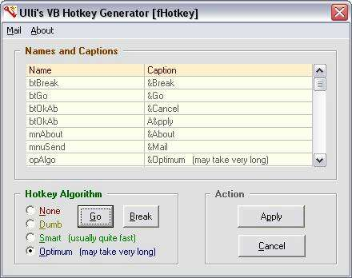



## Automated Accelerator Key Assignment

### Description

This Add-In analyses all (or selected) controls in a form and assigns or generates the necessary accelerator hotkeys, ie those keys that you press together with the Alt-key to access a control (the underlined characters which are preceeded by an ampersand in code). The problem is that a different accelerator key should be selected from the caption of each individual control. To achieve this one has to generate all possible permutations to find the best solution where the accelerator keys are all different and as far to the left as possible.
 
### More Info
 

             |
---                |---
**Submitted On**   |2003-03-03 12:33:28
**By**             |[ULLI](https://github.com/Planet-Source-Code/PSCIndex/blob/master/ByAuthor/ulli.md)
**Level**          |Advanced
**User Rating**    |5.0 (90 globes from 18 users)
**Compatibility**  |VB 6\.0
**Category**       |[VB function enhancement](https://github.com/Planet-Source-Code/PSCIndex/blob/master/ByCategory/vb-function-enhancement__1-25.md)
**World**          |[Visual Basic](https://github.com/Planet-Source-Code/PSCIndex/blob/master/ByWorld/visual-basic.md)
**Archive File**   |[Automated\_155442342003\.zip](https://github.com/Planet-Source-Code/ulli-automated-accelerator-key-assignment__1-43675/archive/master.zip)

